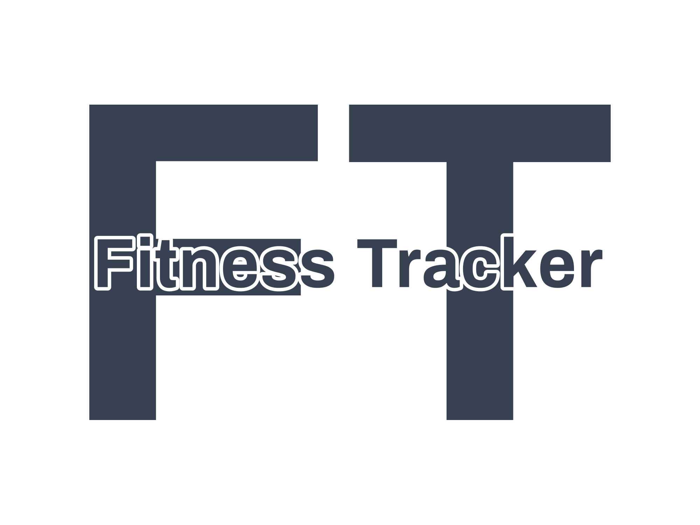

# Fitness Tracker Project</h1>



Welcome to our Fitness Tracker project repository! This project was developed by a team of three students, each contributing their expertise to create a feature-rich fitness tracker application. The team members and their respective roles in the project are as follows:

- **Hassan**: Backend Developer - Primarily responsible for the PHP backend implementation and database design, occasionally contributing to the front-end development.
- **Nesa**: Hybrid Developer - Contributed to both frontend and backend development.
- **Amir**: Frontend Developer - Focused on building the user interface using jQuery and Vanilla JS.

## Project Overview

The Fitness Tracker web application was designed with three main sections: recipes, a to-do list for gym workouts, and a fitness tracker. However, due to time constraints, we focused on implementing the recipes functionality, the homepage, and pages related to login and signup.

The application was developed using the PHP/MySQL/jQuery/JavaScript stack. While we couldn't implement all the planned features, we are proud of the functionalities we were able to deliver.

## Key Features

### PHP Backend Implementation

Despite having no prior experience in PHP, we were able quickly grasp the language's syntax and implement the backend functionalities. Notable features we developed include:

- **Login-Signup Functionality**: A complete authentication system with features like forgot password, password reset, and secure password encryption. All were implemented without using any external libraries as required by the project instructions.

- **Email Server Integration**: Implemented an email verification process after user signup and also added two-factor authentication (2FA) functionality. We also sent personalized welcome emails to clients in HTML format.

- **RESTful API Routes**: Created API routes in PHP to facilitate smooth data loading and updating on the client side without page refreshes. These routes were extensively used on the recipe page.

- **Data Model**: We crafted a well-structured database schema, ensuring that the data was organized in a normalized manner. 

- **Reusable Components**: Inspired by React, we attempted to create reusable components, making the application more maintainable and scalable. For instance, the `render_recipe_card` function was developed to render all recipes retrieved from the database, similar to React's approach.

- **Filtering Recipes**: Users could filter recipes based on their names, specific ingredients they wanted, ingredients they wanted to exclude, minimum and maximum calorie limits, maximum cooking time, and minimum rating.
 
- **Utility Functions**: As a team, we prioritized writing modular code as much as possible, even though time constraints were a factor. We focused on creating reusable functionality for different parts of the application.

### Frontend Development

We crafted the user interface using jQuery and Vanilla JS. Some notable aspects of the frontend include:

- **Custom-built Frontend**: The entire frontend was developed from scratch, adhering to the project's requirements.

- **Ajax**: We leveraged Ajax calls to interact with the APIs on the backend efficiently. These asynchronous calls allowed us to fetch and send data without requiring a full page reload.

- **Interactive and Responsive Design:**: We prioritized making the user interface interactive and responsive.

- **Styling and CSS**: Due to time constraints, we focused on delivering a responsive design for the application within the given timeframe. As a result, the CSS code might not be fully optimized.

## Learning and Growth

What I found most striking and inspiring was my ability to quickly grasp the PHP syntax and successfully apply the core programming concepts I had acquired from other languages. In just two weeks, we developed a functional and feature-rich backend that I am genuinely proud of, showcasing how a solid foundation in programming concepts can pave the way for rapid learning and adaptation to new technologies.

## Possible Future Improvements

As we delivered the project within a tight deadline, there are some areas that could be improved:

- **CSS Refactoring**: Due to time constraints, the CSS file might have some duplication. Given more time, we could refactor the CSS to improve code cleanliness and maintainability.

- **Componentization**: We could further enhance the application's maintainability by fully componentizing the project, which would allow for better code reusability and easier collaboration among team members.

- **Optimizing PHP Usage**: As our exposure to PHP was limited during the project, there may be areas where we could have used more efficient or built-in PHP functions to accomplish certain tasks. Exploring PHP's features and functionalities further can help us identify and implement better approaches in those scenarios.

## Installation and Setup

To set up the Fitness Tracker website on your local server, follow the steps below:

1. Clone the repository from GitHub or Download the project.

2. Set up a PHP development environment with MySQL support. We recommend using Xampp.

3. Create the database using the SQL files provided in the model folder. Additionally, you can insert some test data to populate the database for testing purposes. (they are provided in the model folder)

4. Set up environment variables by creating a .env file and filling in the variables as specified in .env.example.

5. Make sure you have Composer installed on your system. If you don't have it yet, you can download and install it from the official website: https://getcomposer.org/

6. In your project's root directory (where the composer.json file is located), open a terminal or command prompt.

7. Run the following command to install the project's dependencies:
```bash
composer install
```
Once the installation is complete, you should see a vendor directory created in your project containing the installed dependencies.

8. Start a local web server to run the website.

Please note that the project may require some additional configuration based on your local development environment.

## Project Showcase

Here's a glimpse of the Fitness Tracker Website in action:

### Login, write review on recipe and AJAX calls


### Recipe Filtering


## Acknowledgments

We would like to express our gratitude to our instructor, Adnan Reza, for providing us with this opportunity to collaborate on a larger-scale project.

---

Thank you for visiting our repository! If you have any questions or feedback, feel free to reach out to any of our team members. We hope you find the Fitness Tracker application useful and inspiring for your own projects!
